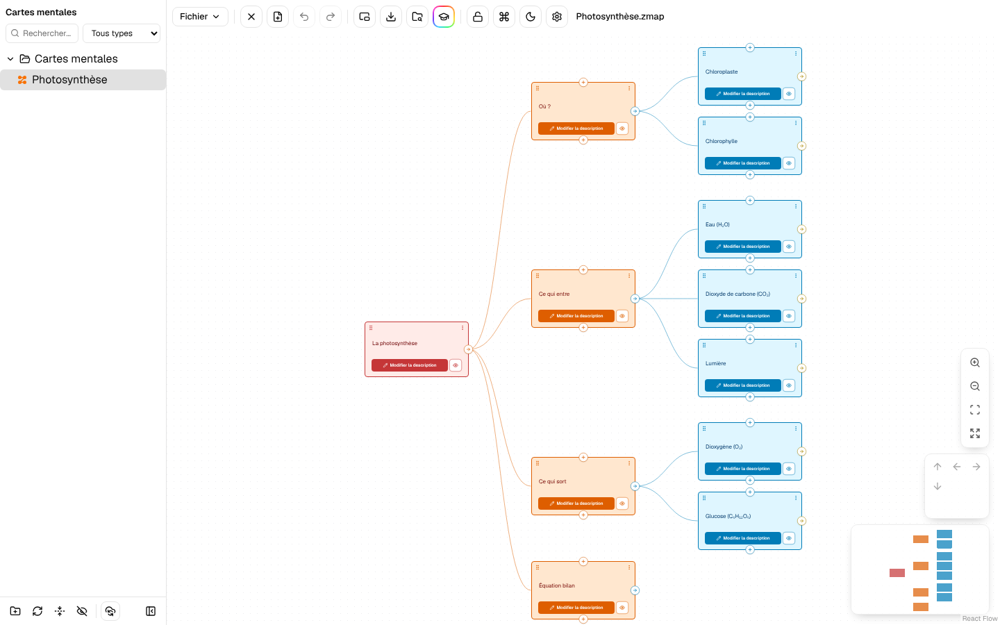
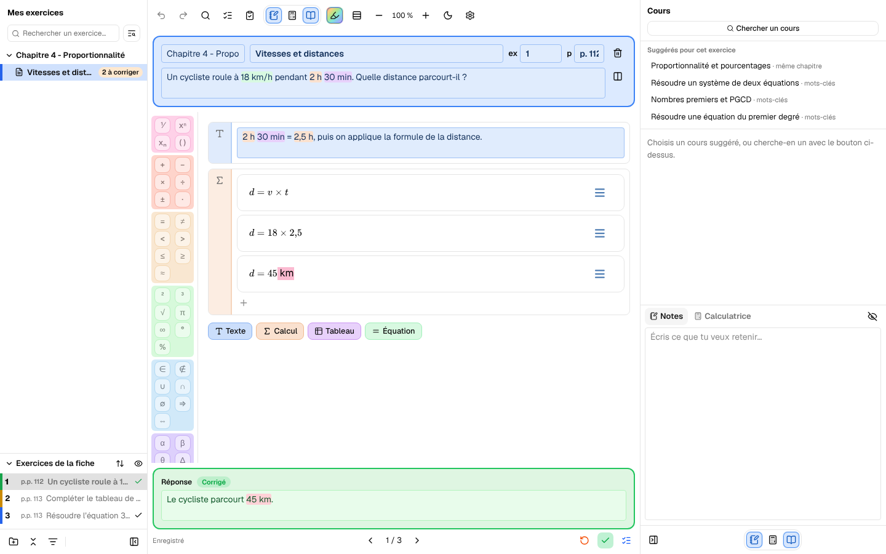
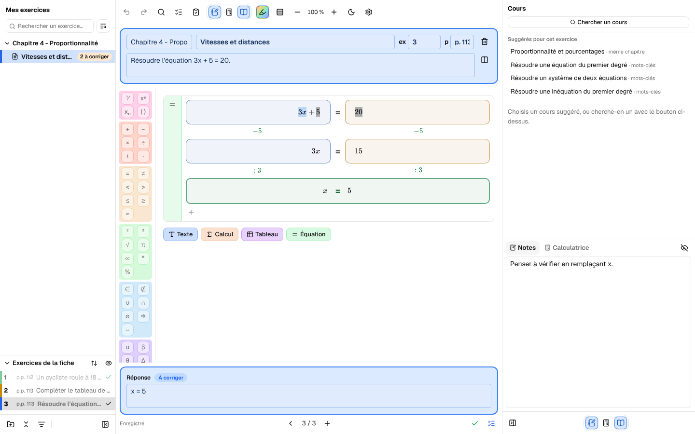

<div align="center">


# Zach'Lab

**La suite de logiciels éducatifs qui t'aide à suivre tes cours.**

Des cartes mentales et des fiches d'exercices, sur ton ordinateur, dessinées pour les élèves.

</div>

---

## Télécharger

Les deux logiciels sont disponibles pour **Windows**. Les liens pointent toujours vers la dernière version.

| Logiciel | Pour quoi faire | Télécharger |
|---|---|---|
| **Zachar't Mentale** | Construire et réviser ses cartes mentales | [Zachart-Mentale-setup.exe](https://github.com/aifedespaix/Zach-Lab/releases/download/updater-zachart/Zachart-Mentale-setup.exe) |
| **Zach'Math** | Travailler les fiches et exercices de mathématiques | [Zachart-Maths-setup.exe](https://github.com/aifedespaix/Zach-Lab/releases/download/updater-zachart-maths/Zachart-Maths-setup.exe) |

Installe, ouvre, c'est prêt. Ensuite, les mises à jour se font toutes seules depuis l'application.
Toutes les versions publiées sont sur la page [Releases](https://github.com/aifedespaix/Zach-Lab/releases).

---

## Le concept

Un élève passe beaucoup de temps à reprendre ses cours, à faire ses exercices et à retrouver ce qu'il
a déjà fait. Zach'Lab réunit ces gestes dans des outils pensés pour l'élève, sans rien demander d'autre
que son ordinateur.

- **Une ergonomie d'élève.** Tout se fait au clavier : créer, déplacer, corriger, passer à l'exercice suivant.
  Les panneaux se replient, le mode condensé gagne de la place, le zoom s'ajuste.
- **Un suivi de cours.** Chaque exercice se marque *corrigé* ou *à revoir*. L'accueil montre ce qui reste
  à faire, les cours suggérés apparaissent à côté de l'exercice, et les notes restent accrochées à la fiche.
- **Des fichiers qui restent à toi.** Les cartes et les fiches sont de simples fichiers sur ton disque, dans
  tes Documents. Rien n'est enfermé dans un service en ligne ; la synchronisation avec un professeur
  reste facultative.
- **Une même interface partout.** Les deux logiciels partagent leur charte graphique, leur palette de
  commandes (`Ctrl/⌘ + K`) et leurs raccourcis. Ce qu'on apprend dans l'un sert dans l'autre.

---

## Zachar't Mentale : les cartes mentales



Une carte se construit par niveaux : un titre, des sous-parties, des détails, et des cartes libres pour
les idées en marge. Une carte peut porter une description riche, et chaque carte mentale a un type
(cours, exercices, prise de notes, corrections…) pour savoir à quoi elle sert.

- **Quatre niveaux de cartes**, avec des couleurs et des icônes pour s'y retrouver.
- **Des questions à trous** pour réviser à partir de sa propre carte.
- **Import et export XMind**, pour récupérer une carte faite ailleurs ou la partager.
- **Synchronisation facultative** avec un serveur, et une **interface web** réservée au professeur.
- **Un explorateur de fichiers** avec recherche et filtre par type, des raccourcis et une palette de commandes.

---

## Zach'Math : les fiches d'exercices



Une fiche reprend une page de manuel. Chaque exercice a son énoncé, sa page, sa zone de travail et sa réponse.
Les fiches sont rangées par chapitre, comme dans le cahier.

- **Des blocs de travail** : texte, calcul ligne à ligne, tableau de proportionnalité, équation pas à pas.
  Les tableaux se remplissent au clavier, et on peut coller du texte depuis un tableur.
- **La correction intégrée** : *à corriger*, *corrigé*, *à revoir*. L'exercice suivant à corriger est à un raccourci.
- **Les cours suggérés** : selon le chapitre et les mots de l'exercice, le cours utile s'affiche à côté.
- **Une calculatrice** et des **notes** par exercice, à portée de main à droite.
- **Des couleurs qui aident à lire** : les unités (km, h, €…) et les termes semblables d'une équation
  prennent chacun une couleur, pour repérer ce qui va ensemble.
- **Annuler et rétablir** sur toute la fiche, la recherche avancée dans toute la bibliothèque, et une
  correction orthographique en français.



---

## Open source

Zach'Lab est un projet ouvert. Le code de chaque logiciel, de la coquille commune et du serveur de
synchronisation est dans ce dépôt, lisible et modifiable.

- **Le dépôt** : un monorepo, organisé par dossiers (voir le tableau ci-dessous).
- **Contribuer** : signale un problème ou propose une amélioration dans les *issues*, ou ouvre une *pull request*.
  Les conventions du projet (structure, tests, commandes) sont décrites dans [CLAUDE.md](CLAUDE.md).
- **Licence** : aucune licence n'est encore publiée dans ce dépôt. Tant qu'un fichier `LICENSE` n'est pas ajouté,
  le code ne doit pas être réutilisé sans l'accord de ses auteurs.

### Structure du dépôt

| Dossier | Contenu |
|---|---|
| `apps/zachart-mentale` | **Zachar't Mentale** : cartes mentales, synchronisation |
| `apps/site` | **Le site** : vitrine, comptes (profs, élèves), bibliothèque web ; `infra/` porte le serveur PocketBase |
| `apps/zachart-maths` | **Zach'Math** : fiches, exercices, cours, calculatrice |
| `apps/base` | Gabarit vide qui fonctionne : le point de départ de chaque nouveau logiciel de la suite |
| `packages/shared` | `@suite/shared` : le code React commun (interface, thème, mises à jour, recherche, équations…) |
| `crates/suite-tauri` | Le socle Rust commun (plugins, ouverture de fichiers, taille de fenêtre) |
| `scripts/` | Création d'une app, montée de version, publication |
| `docs/` | Publication et notes de conception |

---

## Programmer

Il faut [Bun](https://bun.sh), [Rust](https://rustup.rs) et les
[prérequis Tauri](https://tauri.app/start/prerequisites/) de ta plateforme.

```bash
bun install                                    # une fois, à la racine
bun run --filter zachart-mentale tauri dev     # Zachar't Mentale (ou --filter zachart-maths)
bun run test                                   # toutes les suites
```

| Commande | Ce qu'elle fait |
|---|---|
| `bun run test:infra` | les tests de `infra/` (schéma, hooks) |
| `bun run test:scripts` | les tests des scripts du dépôt |
| `bunx tsc --noEmit -p apps/zachart-maths` | vérifie les types d'une app |
| `cargo test --workspace` | les tests du code Rust |
| `bun run new-app <nom>` | crée un nouveau logiciel à partir de `apps/base` |

Ports de développement : Zachar't Mentale `1420`, Zach'Math `1450`, le gabarit `1440`, le site `1460`.

Pour un nouveau logiciel :

```bash
bun run new-app geometrie          # copie apps/base dans apps/geometrie, renomme tout
bun install
bun run --filter geometrie tauri dev
```

Le code partagé (`packages/shared`) ne doit jamais importer une app ; les règles d'architecture sont dans
[CLAUDE.md](CLAUDE.md) et sont vérifiées par des tests.

---

## Déploiement

- **Publier une version** : une version, un tag et une release **par logiciel**. Un simple push ne construit rien,
  seul le tag lance la construction. Guide complet : [docs/RELEASE.md](docs/RELEASE.md).
  ```bash
  bun run deploy zachart-maths minor       # bump, commit, push et tag
  ```
- **Mises à jour** : les logiciels installés vérifient une adresse de mise à jour signée et s'installent
  d'eux-mêmes. Pour construire une mise à jour en local (Windows) : `bun run update:mentale`.
- **Serveur de synchronisation** : PocketBase dans un conteneur Docker, avec sa configuration
  et ses sauvegardes. Voir [infra](infra/README_INFRA.md).

---

## Outils et technologies

| Domaine | Choix |
|---|---|
| Bureau | [Tauri 2](https://tauri.app) (Rust) avec la webview du système |
| Interface | [React 19](https://react.dev), [TypeScript](https://www.typescriptlang.org), [Tailwind CSS 4](https://tailwindcss.com), [shadcn/ui](https://ui.shadcn.com), [Motion](https://motion.dev) |
| État | [Zustand](https://zustand.docs.pmnd.rs) |
| Mathématiques | [MathLive](https://cortexjs.io/mathlive/) pour la saisie, [KaTeX](https://katex.org) pour l'affichage, [mathjs](https://mathjs.org) pour la calculatrice |
| Recherche | [Orama](https://orama.com), en français, tolérante aux accents et aux fautes |
| Orthographe | [Hunspell](https://hunspell.github.io) français via `nspell` |
| Serveur | [PocketBase](https://pocketbase.io), conteneurisé avec Docker |
| Outils | [Bun](https://bun.sh), [Vite](https://vitejs.dev), [Vitest](https://vitest.dev) |

---

<div align="center">

Fait pour que les élèves retrouvent leurs cours plus vite.

</div>
